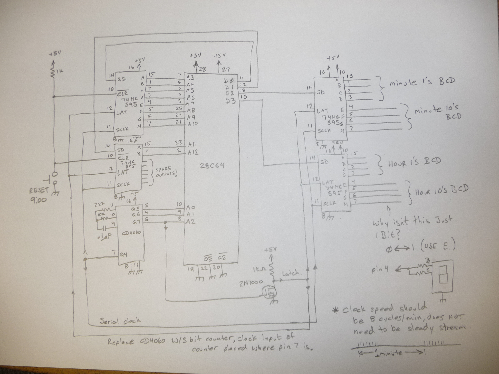
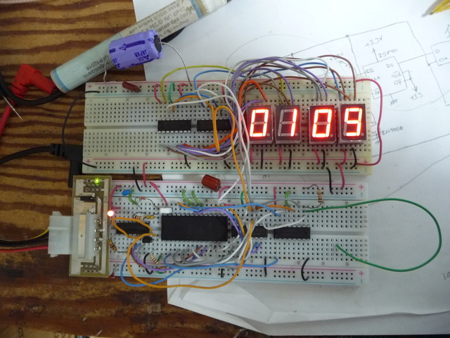

# FSMclock
Clock that uses an FSM to loop thru all the minute modes of a 12 hour cycle

This project might be a bit silly, but its a team effort and helped develop
some other things.

This is a hardware state machine that has the BCD codes for every minute programmed into it.
Its not really efficient...
The clock implemeted is a 12 hour clock with no AM/PM indicator. 
I suppose it really should have used all the feedback bits for output, but the roots it 
evolved from didn't give host to that.

The ROM uses the image output.bin, generated from the C source provided.

Please note that the circuit in the image is using decoders on the back of the displays.

